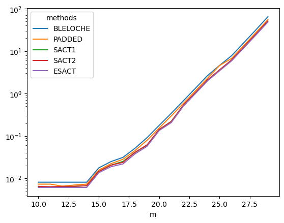

## Tesla T4 (colab)

<caption>
Tesla T4 (colab)
</caption>

[Data](./Tesla-T4/)

## NVIDIA GeForce RTX 4060

<caption>
NVIDIA GeForce RTX 4060
</caption>

[Data](./NVIDIA-GeForce-RTX-4060/)

## NVIDIA GeForce RTX 3060

<caption>
NVIDIA GeForce RTX 3060
</caption>

[Data](./NVIDIA-GeForce-RTX-3060/)

## NVIDIA GeForce RTX 3090

<caption>
NVIDIA GeForce RTX 3090
</caption>

[Data](./NVIDIA-GeForce-RTX-3090/)

## NVIDIA A100 PCIE 40GB

<caption>
NVIDIA A100 PCIE 40GB
</caption>

[Data](./NVIDIA-A100-PCIE-40GB/)

